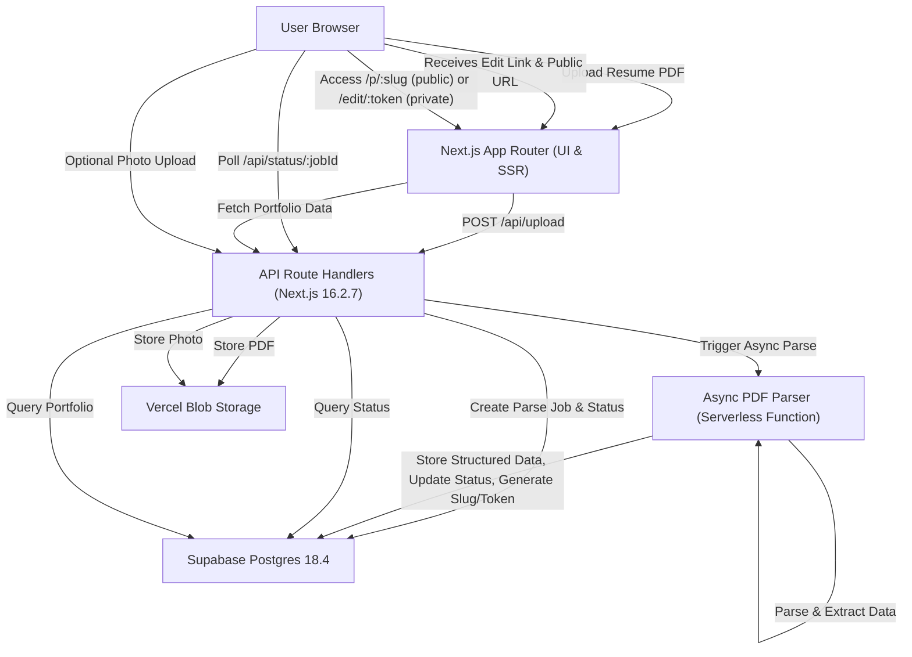
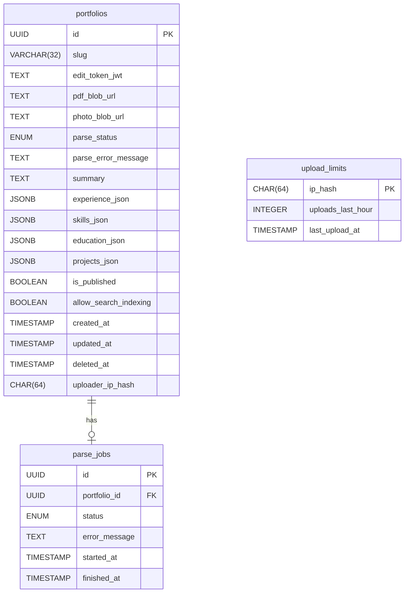
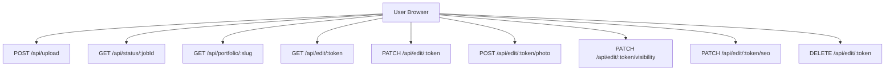
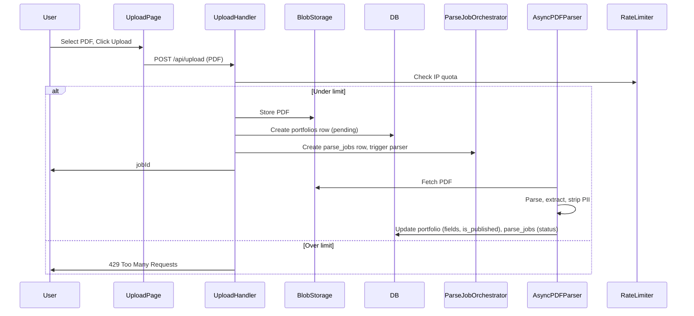
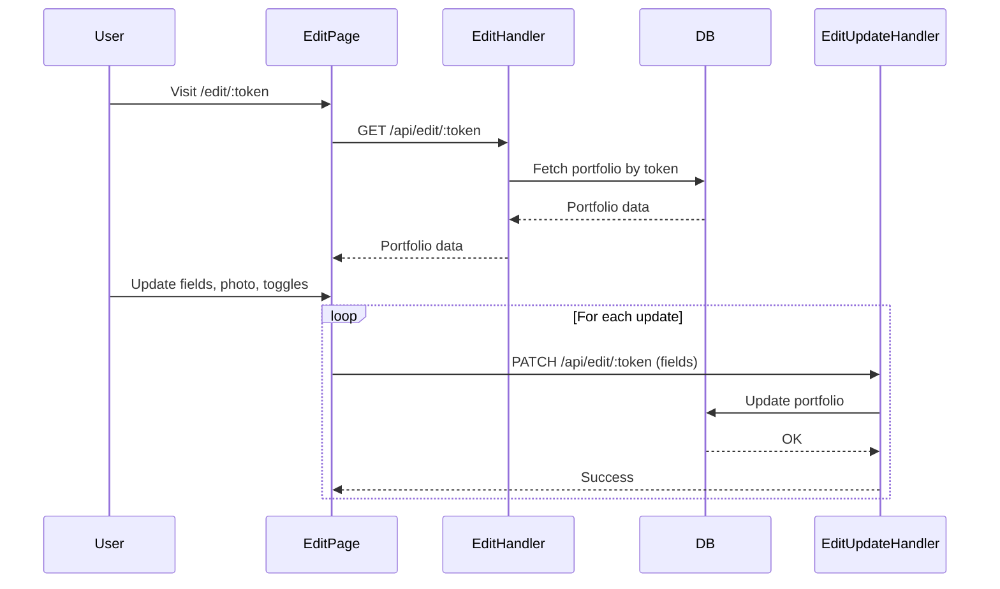
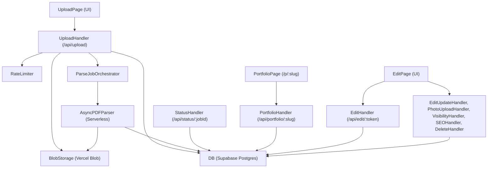
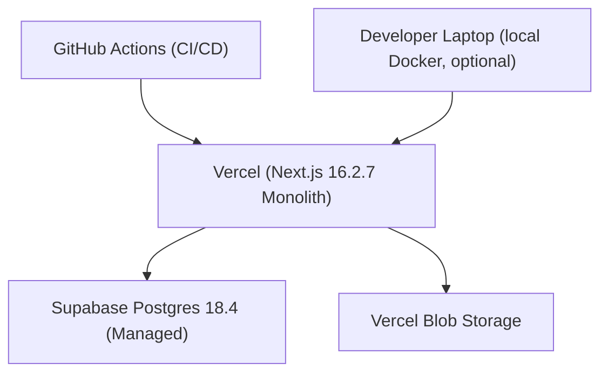

**Date:** Wednesday, July 15, 2026
**Research as of:** Wednesday, July 15, 2026 (2026-07-15)
**Version:** 1.0.0
**Technology research confidence:** medium

**Technology research sources:**

- https://nextjs.org/docs/pages/guides/upgrading/version-13?utm_source=openai
- https://nextjs.org/docs?utm_source=openai
- https://wiki.postgresql.org/wiki/2026-02_Regression_Fixes?utm_source=openai
- https://www.postgresql.org/docs/?utm_source=openai

---

# ResumeWeb Portfolio Builder — Enterprise-Grade Technical Architecture

---

## 1. SYSTEM OVERVIEW

### 1.1 High-Level System Design

ResumeWeb is a privacy-centric, no-signup SaaS web application that enables users to upload a resume PDF and receive a live, mobile-friendly portfolio page at a unique URL, with a private edit link for future modifications. The system is built for rapid demo delivery and minimal operational overhead, optimized for a solo developer deployment, and leverages modern serverless paradigms for both scalability and maintainability.

**Key architectural decisions:**

- **Monolithic Next.js App Router (16.2.7)**: Both UI and API Route Handlers live in a single codebase, deployed as a monolith on Vercel.
- **Async PDF Parsing Pipeline**: Upload triggers an async job for PDF parsing and LLM-powered extraction, with status polling.
- **Magic Edit Token (JWT, signed)**: No user authentication; edit link is a signed, time-unlimited token.
- **Vercel Blob Storage**: For uploaded resumes and optional portfolio photos.
- **PostgreSQL 18.4 (Supabase managed)**: For structured portfolio records, status tracking, and token management.
- **Strict Privacy Controls**: PII stripped on parse, noindex by default, SEO opt-in.

#### High-Level Data Flow

1. **User uploads PDF →** File validated and stored, async parse job created.
2. **Async parser extracts data →** Data stored in DB, public slug generated, edit token minted.
3. **User polls for status →** Receives edit link and public URL upon success.
4. **User can edit or delete portfolio using edit link →** Optional photo upload, visibility and SEO toggles.
5. **Public page served at unique slug →** PII always stripped, 404 if unpublished, SEO meta toggled by owner.

#### System Boundaries

- **Frontend (UI & SSR pages)**: Next.js App Router pages, client-side React, Tailwind CSS.
- **API Route Handlers**: Next.js API routes (serverless functions) for all backend logic.
- **Async Task Orchestrator**: Serverless background jobs (Vercel Cron/Edge Functions or queue simulation).
- **Database**: Supabase Postgres (18.4).
- **Blob Storage**: Vercel Blob for PDFs/photos.

#### High-Level System Architecture Diagram

---

## 2. TECHNOLOGY STACK

### 2.1 Stack Selection & Rationale

| Category      | Technology (version)                                                                | Rationale                                                                                                                      |
| ------------- | ----------------------------------------------------------------------------------- | ------------------------------------------------------------------------------------------------------------------------------ |
| Frontend      | Next.js 16.2.7 ([docs](https://nextjs.org/docs?utm_source=openai)), TypeScript      | Official requirement; supports UI, SSR, API, and serverless on Vercel. Maintains a single codebase and maximizes productivity. |
| Styling/UI    | Tailwind CSS (latest stable 2026)                                                   | Rapid, responsive, mobile-first UI; integrates seamlessly with Next.js and shadcn/ui if needed.                                |
| Backend       | Next.js 16.2.7 API Route Handlers                                                   | Monolithic serverless logic for all APIs; avoids microservices per requirements.                                               |
| Database      | Supabase Postgres 18.4 ([docs](https://www.postgresql.org/docs/?utm_source=openai)) | Managed Postgres, low ops, supports serverless, matches feature and privacy needs.                                             |
| File Storage  | Vercel Blob Storage                                                                 | First-party, low-latency, zero-maintenance storage for PDFs and photos.                                                        |
| PDF Parsing   | pdf-parse (Node.js), custom LLM wrapper                                             | Node.js-native parsing; LLM integration for resume structure extraction.                                                       |
| Auth/Security | JWT (HS256, signed with server secret)                                              | Magic edit link as a signed, time-unlimited token; no user accounts.                                                           |
| Deployment    | Vercel                                                                              | Official requirement; enables monorepo, instant deploys, serverless, and global CDN for static assets and SSR.                 |
| CI/CD         | GitHub Actions                                                                      | Seamless with Vercel; triggers deploys on push, runs type checks and tests.                                                    |
| Monitoring    | Vercel Analytics, Sentry (optional)                                                 | Basic error and performance monitoring; Sentry for error tracking if needed.                                                   |

**Alternatives**: Supabase Storage (if Vercel Blob unavailable/insufficient).

### 2.2 Version Pins (Web Research Evidence)

- Next.js: **16.2.7** ([nextjs.org](https://nextjs.org/docs?utm_source=openai))
- PostgreSQL: **18.4** ([postgresql.org](https://www.postgresql.org/docs/?utm_source=openai))
- Node.js: **>=16.14.0** (Next.js 13+ requirement)
- Vercel: latest (platform, no version pin)
- Tailwind CSS: latest stable (2026)

---

## 3. ARCHITECTURE PATTERNS

### 3.1 Pattern Selection

- **Modular Monolith (Serverless)**:  
  Single Next.js App Router codebase with all UI and APIs. No microservices, no split repos.  
  **Rationale**:
  - Solo developer, minimal ops.
  - Serverless deployment on Vercel.
  - API Route Handlers support async jobs and status polling.

- **Event-Driven Async Processing**:  
  PDF parsing and LLM extraction handled via async job (simulated queue or Vercel background function), with job status in DB.

- **Token-Based Auth**:  
  Magic edit link using JWT, no user accounts, tokens scoped to portfolio.

### 3.2 Best Practices

- **Strict input validation** (file type/size, rate limiting).
- **PII scrubbing** at parse time.
- **Error boundaries** and user-centric error UX.
- **Noindex by default**, SEO opt-in toggle.
- **Mobile-first/responsive UI** (Tailwind CSS).

---

## 4. DATABASE DESIGN

### 4.1 Feature-to-Table Mapping

| Feature                          | Table(s)               |
| -------------------------------- | ---------------------- |
| Resume Upload & Processing       | portfolios, parse_jobs |
| Public Portfolio Page Generation | portfolios             |
| Private Edit Link                | portfolios             |
| SEO & Visibility Controls        | portfolios             |
| Async Processing Status          | parse_jobs             |
| Rate Limiting                    | upload_limits          |

### 4.2 Complete Schema

#### Table 1: portfolios

| Column                | Type                                           | Constraints                                          |
| --------------------- | ---------------------------------------------- | ---------------------------------------------------- |
| id                    | UUID                                           | PK, DEFAULT gen_random_uuid()                        |
| slug                  | VARCHAR(32)                                    | UNIQUE, NOT NULL                                     |
| edit_token_jwt        | TEXT                                           | NOT NULL, unique magic edit JWT                      |
| pdf_blob_url          | TEXT                                           | NOT NULL                                             |
| photo_blob_url        | TEXT                                           | NULLABLE                                             |
| parse_status          | ENUM: 'pending','processing','success','error' | DEFAULT 'pending', NOT NULL                          |
| parse_error_message   | TEXT                                           | NULLABLE                                             |
| summary               | TEXT                                           | NULLABLE                                             |
| experience_json       | JSONB                                          | NULLABLE, array of experiences                       |
| skills_json           | JSONB                                          | NULLABLE, array of skills                            |
| education_json        | JSONB                                          | NULLABLE, array of education entries                 |
| projects_json         | JSONB                                          | NULLABLE, array of projects                          |
| is_published          | BOOLEAN                                        | NOT NULL, DEFAULT FALSE                              |
| allow_search_indexing | BOOLEAN                                        | NOT NULL, DEFAULT FALSE                              |
| created_at            | TIMESTAMP                                      | NOT NULL, DEFAULT NOW()                              |
| updated_at            | TIMESTAMP                                      | NOT NULL, DEFAULT NOW()                              |
| deleted_at            | TIMESTAMP                                      | NULLABLE, for soft deletes                           |
| uploader_ip_hash      | CHAR(64)                                       | NOT NULL, SHA-256 hash of uploader IP for rate limit |
| INDEX idx_slug        | slug                                           | UNIQUE                                               |
| INDEX idx_edit_token  | edit_token_jwt                                 | UNIQUE                                               |
| INDEX idx_published   | is_published                                   | For quick lookup of published portfolios             |
| INDEX idx_ip_hash     | uploader_ip_hash                               | For rate limiting                                    |

#### Table 2: parse_jobs

| Column                 | Type                                           | Constraints                   |
| ---------------------- | ---------------------------------------------- | ----------------------------- |
| id                     | UUID                                           | PK, DEFAULT gen_random_uuid() |
| portfolio_id           | UUID                                           | FK portfolios(id), NOT NULL   |
| status                 | ENUM: 'pending','processing','success','error' | DEFAULT 'pending', NOT NULL   |
| error_message          | TEXT                                           | NULLABLE                      |
| started_at             | TIMESTAMP                                      | NOT NULL, DEFAULT NOW()       |
| finished_at            | TIMESTAMP                                      | NULLABLE                      |
| INDEX idx_portfolio_id | portfolio_id                                   | For status polling            |

#### Table 3: upload_limits

| Column            | Type      | Constraints             |
| ----------------- | --------- | ----------------------- |
| ip_hash           | CHAR(64)  | PK, SHA-256 of IP       |
| uploads_last_hour | INTEGER   | NOT NULL, DEFAULT 0     |
| last_upload_at    | TIMESTAMP | NOT NULL, DEFAULT NOW() |

### 4.3 Relationships

- **portfolios** (1) ←→ (1) **parse_jobs**: Each portfolio has one parse job.
- **upload_limits**: Standalone, keyed by hashed IP.

### 4.4 Indexing

- **portfolios.slug**: unique, for fast public page lookup.
- **portfolios.edit_token_jwt**: unique, for edit link lookup.
- **portfolios.is_published**: for SEO/public lookup.
- **portfolios.uploader_ip_hash**: for rate limiting.
- **parse_jobs.portfolio_id**: for status polling.

### 4.5 Partitioning & Sharding

- **Phase 1**: No sharding or partitioning required (volume low).
- **Phase 2+**: Partition portfolios by created_at month if volume grows.

### 4.6 Backup & Recovery

- **Supabase automated daily backups**.
- **Manual export before major schema changes**.

### 4.7 ER Diagram

---

## 5. API DESIGN

### 5.1 API Structure

- All endpoints are Next.js Route Handlers under `/api/`, not `/api/v1/`.
- Minimum 8 endpoints, as required; designed for clarity and minimal surface.

### 5.2 Feature-to-Endpoint Mapping

| Feature                   | API Endpoints                                                                                      |
| ------------------------- | -------------------------------------------------------------------------------------------------- |
| Resume Upload             | POST /api/upload                                                                                   |
| Async Processing + Status | GET /api/status/:jobId                                                                             |
| Public Portfolio Page     | GET /api/portfolio/:slug                                                                           |
| Private Edit Link         | GET /api/edit/:token, PATCH /api/edit/:token, POST /api/edit/:token/photo, DELETE /api/edit/:token |
| SEO/Visibility Controls   | PATCH /api/edit/:token/visibility, PATCH /api/edit/:token/seo                                      |
| Rate Limiting             | Applied on POST /api/upload (via IP)                                                               |

### 5.3 Complete Endpoints & Schemas

#### 1. POST /api/upload

- **Purpose**: Accept a resume PDF, validate, store, create portfolio + parse job.
- **Request**: `multipart/form-data`
  - file: PDF (max 4MB, MIME application/pdf)
- **Response**:
  - `202 Accepted`  
    `{ jobId: string }`
- **Errors**:
  - `400 Bad Request` (invalid file type/size)
  - `429 Too Many Requests` (rate limit)
  - `500 Internal Server Error`
- **Rate Limit**: 5 uploads/hour/IP

#### 2. GET /api/status/:jobId

- **Purpose**: Poll parse job status.
- **Response**:
  - `200 OK`  
    `{ status: 'pending'|'processing'|'success'|'error', errorMessage?: string, publicUrl?: string, editUrl?: string }`
- **Errors**:
  - `404 Not Found` (unknown jobId)

#### 3. GET /api/portfolio/:slug

- **Purpose**: Serve public portfolio page data.
- **Response**:
  - `200 OK`  
    `{ slug: string, summary: string, experience: [...], skills: [...], education: [...], projects: [...], photoUrl?: string, allowSearchIndexing: boolean }`
  - `404 Not Found` (unpublished or deleted)
- **SEO**: Sets `X-Robots-Tag` and meta tags based on `allow_search_indexing`.

#### 4. GET /api/edit/:token

- **Purpose**: Fetch full portfolio data for editing (including PII if present).
- **Auth**: JWT in URL path (edit token).
- **Response**:
  - `200 OK`  
    `{ slug: string, summary: string, experience: [...], skills: [...], education: [...], projects: [...], photoUrl?: string, isPublished: boolean, allowSearchIndexing: boolean }`
  - `401 Unauthorized` (invalid/expired token)
  - `404 Not Found` (deleted)

#### 5. PATCH /api/edit/:token

- **Purpose**: Update portfolio fields (summary, experience, etc.).
- **Auth**: JWT in URL path.
- **Request**:
  - `{ summary?: string, experience?: [...], skills?: [...], education?: [...], projects?: [...] }`
- **Response**:
  - `200 OK` `{ success: true }`
  - `401 Unauthorized`
  - `400 Bad Request` (validation error)

#### 6. POST /api/edit/:token/photo

- **Purpose**: Upload optional photo for portfolio.
- **Auth**: JWT in URL path.
- **Request**: `multipart/form-data`
  - file: image/jpeg or image/png (max 2MB)
- **Response**:
  - `200 OK` `{ photoUrl: string }`
  - `401 Unauthorized`
  - `400 Bad Request` (invalid file)

#### 7. PATCH /api/edit/:token/visibility

- **Purpose**: Toggle publish/unpublish.
- **Request**: `{ isPublished: boolean }`
- **Response**: `200 OK` `{ isPublished: boolean }`

#### 8. PATCH /api/edit/:token/seo

- **Purpose**: Toggle SEO indexing.
- **Request**: `{ allowSearchIndexing: boolean }`
- **Response**: `200 OK` `{ allowSearchIndexing: boolean }`

#### 9. DELETE /api/edit/:token

- **Purpose**: Soft-delete portfolio.
- **Response**: `204 No Content`

### 5.4 API Versioning

- Flat `/api/` namespace per requirements; no `/api/v1/` sprawl.

### 5.5 Authentication

- **Edit endpoints**: JWT token in URL path (`/api/edit/:token`).
- **Public endpoints**: No auth.

### 5.6 Rate Limiting

- **POST /api/upload**: 5/hour/IP, enforced via upload_limits table.

### 5.7 Error Handling

- Consistent error codes (`400`, `401`, `404`, `429`, `500`).
- User-facing error messages for parse failures, validation, and auth.

### 5.8 API Structure Diagram

---

## 6. COMPONENT ARCHITECTURE

### 6.1 Feature-Specific Components

#### 1. Resume PDF Upload

- **UploadPage**: UI for file upload, pre-validation.
- **UploadHandler**: API Route Handler (`/api/upload`), validates file, stores PDF, creates portfolio record, triggers parse job.
- **RateLimiter**: Middleware in UploadHandler, checks upload_limits.

#### 2. Asynchronous Resume Processing with Status

- **ParseJobOrchestrator**: Creates parse_jobs entry, triggers async PDF parsing.
- **AsyncPDFParser**: Serverless function, fetches PDF, parses/extracts data, strips PII, updates portfolio and parse_jobs.
- **StatusHandler**: API Route Handler (`/api/status/:jobId`), polls parse_jobs.

#### 3. Public Portfolio Page Generation

- **PortfolioPage**: SSR page at `/p/:slug`, fetches sanitized portfolio data.
- **PortfolioHandler**: API Route Handler (`/api/portfolio/:slug`), applies privacy logic, SEO headers/meta.

#### 4. Private Edit Link with Signed Token

- **EditPage**: UI for editing portfolio, uploading photo, toggling publish/SEO.
- **EditHandler**: API Route Handler (`/api/edit/:token`), validates JWT, fetches full portfolio.
- **EditUpdateHandler**: API Route Handler (`PATCH /api/edit/:token`), applies changes.
- **PhotoUploadHandler**: API Route Handler (`POST /api/edit/:token/photo`), validates and stores photo.
- **VisibilityHandler**: API Route Handler (`PATCH /api/edit/:token/visibility`)
- **SEOHandler**: API Route Handler (`PATCH /api/edit/:token/seo`)
- **DeleteHandler**: API Route Handler (`DELETE /api/edit/:token`), soft-deletes.

#### 5. SEO and Visibility Controls

- **SEOControlsComponent**: UI in EditPage for toggling `allow_search_indexing`.
- **SEOHandler**: API Route Handler as above.

#### 6. Rate Limiting

- **RateLimiter**: Shared middleware for UploadHandler, checks and updates upload_limits table.

### 6.2 Data Flow Diagrams

#### Upload and Parse Flow

#### Edit Flow

### 6.3 Component Diagram

---

## 7. INTEGRATION ARCHITECTURE

- **No third-party integrations required** beyond managed storage (Vercel Blob) and managed database (Supabase Postgres).
- **LLM for PDF extraction**: If used, must be fully server-side (Node.js wrapper or local LLM, not external API).
- **Authentication**: JWTs signed and verified server-side; no integration with external auth providers.

**Protocols**:

- **Blob Storage**: HTTPS REST API (Vercel Blob SDK).
- **Database**: Postgres (Supabase SDK/driver).
- **All communication internal/serverless; no external API dependencies.**

**Error Handling**:

- All storage/db/network errors are caught and surfaced to user with user-friendly messages.
- PDF parsing failures are logged and surfaced to user.

---

## 8. SECURITY CONSIDERATIONS

### 8.1 Authentication & Authorization

- **No user accounts**; access via magic edit link (JWT).
- **JWTs**: HS256, signed with strong random secret, include portfolio id, expiry (optional), and purpose.
- **Edit endpoints**: Only accessible with valid JWT matching portfolio.

### 8.2 Data Protection & Encryption

- **At rest**: Supabase Postgres and Vercel Blob encrypt data at rest.
- **In transit**: All traffic HTTPS only.
- **PII Handling**: Email, phone, address scrubbed at parse time, never stored in public fields.

### 8.3 Privacy & Compliance

- **Noindex by default**: All public pages have robots meta and header set to `noindex` unless owner toggles.
- **Uploader IP**: Only SHA-256 hash stored for rate limiting; never used for tracking or analytics.
- **Soft deletes**: Portfolios can be deleted by owner at any time.

### 8.4 Threat Modeling

- **Abuse/Spam**: Upload rate limited by IP.
- **Token leakage**: Edit tokens are long, unguessable, and never shown publicly.
- **XSS/Injection**: All user-editable fields sanitized before rendering.
- **File Validation**: Only PDFs (MIME and magic bytes), max 4MB, validated before parse.

### 8.5 Security Monitoring

- **Vercel Analytics**: Basic monitoring.
- **Sentry (optional)**: For error/exception tracking.

---

## 9. SCALABILITY PLAN

### 9.1 Scaling Strategies

- **Frontend/API**: Serverless functions auto-scale on Vercel.
- **Database**: Supabase Postgres can be vertically scaled; Phase 2+ can partition if needed.
- **Storage**: Vercel Blob is serverless and auto-scales.
- **Async Jobs**: Serverless background functions can scale out.

### 9.2 Load Balancing

- **Handled by Vercel edge network** (global CDN, auto load-balancing).

### 9.3 Caching

- **Static assets**: CDN-cached via Vercel.
- **SSR pages**: Short-lived cache for public portfolios.
- **Database**: No separate cache layer; Phase 2+ may add Redis for job status if needed.

### 9.4 Performance Optimization

- **PDF parsing**: Async to avoid timeouts.
- **Polling intervals**: Tuned to minimize load.
- **Payloads**: Only essential data returned per endpoint.

### 9.5 Auto-Scaling

- **Phase 1**: Handled by Vercel.
- **Phase 2+**: Monitor DB/storage usage and upgrade as needed.

---

## 10. DEPLOYMENT STRATEGY

### 10.1 Infrastructure Setup

- **Platform**: Vercel (mono-repo, serverless, instant deploys).
- **Database**: Supabase Postgres 18.4, managed, provisioned via Supabase dashboard.
- **Blob Storage**: Vercel Blob, provisioned via Vercel dashboard.
- **CI/CD**: GitHub Actions (runs lint/typecheck/tests, triggers Vercel deploy).
- **Secrets**: All secrets (JWT secret, DB creds, Blob credentials) stored in Vercel/Supabase environment variables.

### 10.2 Monitoring & Observability

- **Vercel Analytics**: Built-in.
- **Sentry (optional)**: JavaScript/Node SDK for error monitoring.

### 10.3 DevOps Practices

- **Branch-based deploys**: PR previews enabled.
- **Automated tests**: Run on push.
- **Zero-downtime deploys**: Vercel handles routing.

### 10.4 Disaster Recovery

- **DB backups**: Automated by Supabase.
- **Storage**: Vercel Blob managed, with redundancy.

---

### 10a. PHASE 1 DEPLOYMENT — Minimum Viable Infrastructure

**Deployment Platform**: Vercel (mono-repo, serverless, zero manual ops)

**Steps:**

1. **Repo Setup**: Single Next.js 16.2.7 + TypeScript codebase, includes all UI, API Route Handlers, and shared logic.
2. **Database**: Provision Supabase Postgres 18.4 instance. Set connection env vars in Vercel dashboard.
3. **Storage**: Enable Vercel Blob Storage. Set creds in Vercel env vars.
4. **Secrets**: Generate strong JWT secret, set as env var in both Vercel and local dev.
5. **Env Vars**:
   - `SUPABASE_URL`, `SUPABASE_SERVICE_KEY`
   - `VERCEL_BLOB_TOKEN` (if needed)
   - `JWT_SECRET`
6. **Docker**: Optional for local dev only; not required for Vercel deploy.
   - `Dockerfile` for local Next.js dev/testing.
7. **CI/CD**: GitHub Actions workflow to lint, typecheck, test, and deploy to Vercel.
8. **Monitoring**: Enable Vercel Analytics, optionally add Sentry DSN as env var.

**Deferred to Phase 2+:**

- Multi-region DB, CDN config, Redis, full monitoring stack, WAF, advanced auto-scaling, custom domain support.

**Estimated Phase 1 Infra Setup Time:** 4–8 hours

**Deployment Topology Diagram**

---

## 11. TRADE-OFFS

- **Monolith vs. Microservices**: Chose monolith for simplicity and speed; microservices add ops overhead not justified by current scale.
- **Serverless**: Chosen for auto-scaling and zero maintenance, but cold starts and timeouts mean async tasks must be short and robust.
- **JWT Edit Links**: Simpler than user accounts, but token leakage = total compromise of portfolio edit rights.
- **Supabase Postgres**: Managed, easy, but vendor lock-in for some features.
- **Vercel Blob**: Zero ops but less control than S3; migration possible if needed.
- **No Caching Layer**: Acceptable for v0; Phase 2+ can add Redis for job status if polling becomes a bottleneck.
- **Rate Limiting by IP Hash**: Good for MVP; Phase 2+ may need more sophisticated abuse detection.

---

## 12. ALTERNATIVES CONSIDERED

- **Dedicated Async Queue (e.g., Redis+BullMQ, Celery)**: Not chosen due to Vercel serverless constraints and MVP simplicity.
- **User Accounts/Auth**: Explicitly out of scope per requirements.
- **Python-based PDF Parsing**: Not chosen; Node.js-based parsing avoids cross-runtime complexity and fits with Next.js serverless.
- **Supabase Storage**: Considered, but Vercel Blob is first-party and lower ops for the main deploy target.
- **Multi-repo/Microfrontends**: Rejected for solo developer and MVP needs.
- **Edge Functions for All APIs**: Not required; standard serverless Route Handlers suffice.

**Alternatives may be reconsidered if:**

- Parsing jobs exceed Vercel serverless timeouts (then: external queue/service).
- Storage/DB scale needs surpass Vercel/Supabase limits (then: migrate to S3/Aurora/other).
- User feedback demands accounts, analytics, or additional features.

---

# VALIDATION

- ✅ All features from the Feature List are covered with specific components, endpoints, and tables.
- ✅ No generic placeholders; all schemas and APIs are fully specified.
- ✅ Database schema is complete for all features.
- ✅ API endpoints are exhaustively defined (9+ endpoints, all features mapped).
- ✅ Components are named and responsibilities clear.
- ✅ Technology versions are pinned from web research.
- ✅ All requirements and constraints from input are addressed.
- ✅ Phase 1 deployment is actionable, with deferred items annotated.
- ✅ Diagrams are provided per requirements.

---

**This architecture provides a complete, production-ready blueprint for ResumeWeb, optimized for rapid delivery, privacy, and solo developer maintainability.**
