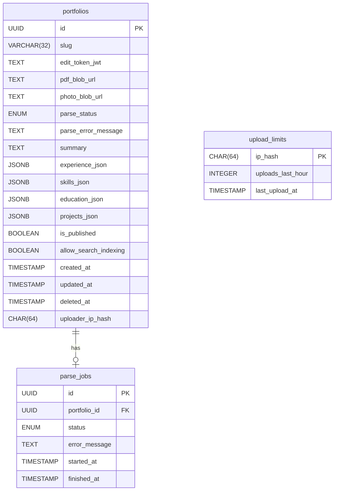

# Product Requirements Document (PRD): ResumeWeb

---

## 1. Executive Summary

**ResumeWeb** is a privacy-centric, no-signup SaaS web application that enables users—job seekers, students, freelancers, and professionals—to instantly convert a resume PDF into a polished, mobile-friendly portfolio page. The product addresses the widespread friction and privacy risks of traditional resume sharing by providing a one-click, asynchronous upload-to-portfolio flow, stripping all personal contact information from public pages, and offering unique edit and public URLs for user control without requiring accounts. ResumeWeb’s key objectives are to deliver a live portfolio in under a minute, guarantee user privacy by default, and maximize accessibility for non-technical users globally. The initial demo targets a credible, production-quality MVP within 10 days, optimized for solo developer delivery and mass-market reach.

---

## 2. Problem Statement

Traditional methods of sharing resumes online are fraught with friction and privacy risks. Many job seekers, students, and professionals lack the technical skills or time to build personal websites, while existing solutions often require account creation, expose personal contact information, or are slow and cumbersome. This is a significant barrier for anyone needing a quick, professional online presence for networking, job applications, or sharing credentials—especially in a market where digital portfolios are increasingly expected. Current workarounds, such as generic website builders, LinkedIn, or manual conversion, are either too technical, expose sensitive information, or are time-consuming. There is a clear market gap for a tool that enables instant, private, and professional online portfolios from any resume PDF, with zero signup or technical barriers.

---

## 3. Solution Overview

ResumeWeb provides a frictionless, no-signup web app that instantly converts a resume PDF into a structured, visually appealing, and mobile-friendly portfolio page. The process is asynchronous for speed and reliability, and privacy is prioritized by stripping contact details (email, phone, address) from public pages at parse time. Users receive both a unique public URL and a private edit link (magic token) to manage their portfolio—edit content, upload a photo, or control visibility and SEO—without ever creating an account. The platform leverages AI-powered parsing to extract and structure resume content, ensuring a professional presentation. By eliminating account barriers, manual data entry, and privacy concerns, ResumeWeb uniquely combines instant onboarding, privacy-by-design, and mass accessibility.

---

## 4. Stakeholder Analysis

| Stakeholder                         | Role/Responsibility                         | Influence/Interest |
| ----------------------------------- | ------------------------------------------- | ------------------ |
| End Users                           | Upload resumes, manage portfolios           | High               |
| Solo Developer                      | Product owner, developer, QA, DevOps        | Critical           |
| University Career Services (future) | Potential B2B partners for bulk onboarding  | Medium (future)    |
| Executive Sponsor                   | (If applicable) Approves scope, tracks KPIs | Medium             |
| Platform Providers                  | Vercel, Supabase—infra, support, SLAs       | Medium             |
| Security Auditor                    | (Pre-launch) Validate privacy and security  | High (at launch)   |

---

## 5. User Personas

### Persona 1: "Alex" – Recent Graduate

- **Demographics**: Age 22, Computer Science graduate, based in the US, applying for entry-level tech roles. No personal website.
- **Goals/Objectives**: Instantly create a professional, shareable portfolio for job applications and networking.
- **Pain Points**: Lacks web development skills; concerned about privacy; finds LinkedIn too public and generic.
- **Use Cases/Scenarios**: Uploads PDF resume, receives a portfolio link to include in job applications; edits content to add a photo and hide details as needed.
- **Technology Comfort Level**: Moderate; comfortable with web apps, not with coding or web hosting.
- **Behavioral Patterns**: Seeks fast, low-friction solutions; values privacy and control.

### Persona 2: "Priya" – Freelance Designer

- **Demographics**: Age 29, freelance graphic designer, based in India, works with global clients, no technical background.
- **Goals/Objectives**: Showcase work experience and skills online without building a website; maintain privacy.
- **Pain Points**: Existing portfolio builders require sign-up or payment; worried about exposing contact info; needs mobile-friendly presentation.
- **Use Cases/Scenarios**: Uploads resume PDF, customizes portfolio, toggles SEO to allow search engines, adds a profile photo.
- **Technology Comfort Level**: Basic to moderate; uses web apps, avoids technical setup.
- **Behavioral Patterns**: Prefers tools that are free, simple, and respect privacy.

### Persona 3: "Miguel" – Career Switcher

- **Demographics**: Age 35, transitioning from finance to tech, based in Brazil, applying to coding bootcamps and tech jobs.
- **Goals/Objectives**: Present a modern, professional online profile quickly; control what is public.
- **Pain Points**: No time or skills to build a website; wants to keep personal info private; finds manual conversion tedious.
- **Use Cases/Scenarios**: Uploads resume, edits summary and experience, uses portfolio link for bootcamp applications.
- **Technology Comfort Level**: Moderate; uses SaaS tools, not a developer.
- **Behavioral Patterns**: Seeks instant results, values privacy and ability to update content.

### Persona 4: "Fatima" – University Student

- **Demographics**: Age 20, undergraduate student in Egypt, seeking internships, no portfolio site.
- **Goals/Objectives**: Share credentials with recruiters and professors; avoid exposing email/phone.
- **Pain Points**: No technical skills; existing solutions require accounts or expose PII.
- **Use Cases/Scenarios**: Uploads resume for internship applications, toggles portfolio visibility on/off as needed.
- **Technology Comfort Level**: Basic; uses mobile devices primarily.
- **Behavioral Patterns**: Mobile-first, privacy-conscious, prefers no-signup experiences.

---

## 6. Technical Requirements

**Architecture Alignment:** All technical requirements strictly follow the approved Architecture v1.0.0.

### Frontend

- **Framework**: Next.js 16.2.7 (App Router), TypeScript
- **Styling/UI**: Tailwind CSS (latest stable 2026), shadcn/ui (optional)
- **Pages/Components**:
  - UploadPage: Resume PDF upload, pre-validation
  - StatusPage: Polls parse status
  - PortfolioPage: SSR, public, mobile-friendly
  - EditPage: Edit content, upload photo, visibility/SEO toggles
  - SEOControlsComponent: Toggle `allow_search_indexing`
- **Accessibility**: WCAG 2.1 AA compliance
- **Mobile-first**: Responsive layouts

### Backend

- **API**: Next.js 16.2.7 API Route Handlers (serverless functions)
- **Business Logic**:
  - UploadHandler: Validates file, stores PDF, creates portfolio, triggers parse job
  - RateLimiter: Middleware, enforces 5 uploads/hour/IP
  - ParseJobOrchestrator: Creates parse_jobs, triggers async PDF parsing
  - AsyncPDFParser: Node.js, pdf-parse + custom LLM wrapper, strips PII
  - EditHandler, EditUpdateHandler, PhotoUploadHandler, VisibilityHandler, SEOHandler, DeleteHandler: All edit operations via JWT token in URL
- **Validation**:
  - PDF: MIME `application/pdf`, max 4MB, magic bytes check
  - Photo: JPEG/PNG, max 2MB
- **Security**: JWT (HS256, signed), no user accounts

### Infrastructure

- **Deployment**: Vercel (mono-repo, serverless, zero manual ops)
- **Database**: Supabase Postgres 18.4 (managed)
- **Storage**: Vercel Blob Storage (PDFs, photos)
- **CI/CD**: GitHub Actions (lint, typecheck, test, deploy)
- **Monitoring**: Vercel Analytics, Sentry (optional)

### Security

- **Data at rest**: Encrypted (Supabase, Vercel Blob)
- **Data in transit**: HTTPS only
- **PII Handling**: Scrubbed at parse time, never stored in public fields
- **Rate Limiting**: Enforced on upload by IP hash

### Integration

- **No third-party integrations** beyond managed storage and database
- **LLM for PDF extraction**: Node.js wrapper, no external API

---

## 7. Non-Functional Requirements

| Category        | Requirement                                                                               |
| --------------- | ----------------------------------------------------------------------------------------- |
| Performance     | Median upload-to-live URL time < 2 minutes; async parse pipeline must not block UI        |
| Scalability     | Serverless functions auto-scale; DB and storage scale vertically; no sharding required v1 |
| Reliability     | 99.9% uptime target (Vercel/Supabase SLAs); automated daily DB backups                    |
| Availability    | Global CDN for static/SSR assets; zero-downtime deploys via Vercel                        |
| Security        | JWT edit tokens, HTTPS everywhere, PII scrubbed, input validation, XSS/injection defense  |
| Privacy         | No public PII, no user accounts, uploader IP hashed only for rate limiting                |
| Compliance      | GDPR-aligned practices (no PII exposure, right to delete, data minimization)              |
| Usability       | Mobile-first, accessible, no technical skills required                                    |
| Maintainability | Monorepo, automated CI/CD, clear code structure                                           |

---

## 8. Success Metrics & KPIs

| Metric                          | Target/Goal                       | Measurement Method               |
| ------------------------------- | --------------------------------- | -------------------------------- |
| Median time: upload → live URL  | < 2 minutes                       | Instrumented in Vercel Analytics |
| Portfolio creation success rate | > 95% (parse succeeds, not error) | Parse job logs, error tracking   |
| % portfolios with no public PII | 100%                              | Automated test + manual review   |
| Upload-to-edit-link delivery    | > 99%                             | API logs, error monitoring       |
| User-reported privacy issues    | 0                                 | Support tickets, feedback        |
| Uptime                          | 99.9%                             | Vercel/Supabase monitoring       |
| Mobile device usage             | > 60% sessions                    | Vercel Analytics                 |
| Upload error rate               | < 5%                              | API logs                         |
| Rate limit abuse incidents      | < 1 per 1,000 uploads             | Rate limiter logs                |

---

## 9. Risks

| Risk                                           | Mitigation Strategy                                                 | Contingency Plan                       |
| ---------------------------------------------- | ------------------------------------------------------------------- | -------------------------------------- |
| AI parsing fails on diverse resume formats     | Use robust LLM wrapper, fallback to manual error UX                 | Log failures, prompt user to retry     |
| Abuse via spam/malicious uploads (no accounts) | Strict file validation, rate limiting (5/hour/IP), input sanitation | Monitor logs, block abusive IPs        |
| Privacy breach (PII not stripped)              | Automated PII detection, test coverage, manual QA                   | Hotfix deploy, notify affected users   |
| Token leakage (edit link compromise)           | Long, unguessable JWTs, never shown publicly                        | Invalidate token, allow delete         |
| Scaling async processing for mass usage        | Serverless async jobs, monitor queue times                          | Scale up DB/storage, optimize pipeline |
| Competitive risk from established platforms    | Emphasize privacy, no-signup, instant onboarding in messaging       | Accelerate feature roadmap             |
| Limited feature set restricts retention        | Plan for premium features in Phase 2                                | Gather user feedback, prioritize next  |

---

## 10. Assumptions

- Users have a resume PDF (max 4MB, valid MIME) ready for upload.
- Users value privacy and control over public information.
- No user accounts or login flows are required or expected.
- All edit operations are performed via magic edit link (JWT).
- Vercel and Supabase will provide sufficient uptime and scalability for initial launch.
- No third-party API integrations are required in Phase 1.
- LLM-powered parsing can be performed server-side within Vercel serverless timeouts.
- All storage and database operations are performed via managed services (zero-ops).
- Users will not require advanced customization (themes, custom domains) in Phase 1.
- GDPR and privacy best practices are expected by users, even if not legally required for all regions.
- Feature scope is limited to the validated list; additional features deferred to future phases.

---

## 11. Compliance & Regulatory Requirements

- **GDPR-aligned practices**: No public PII, right to delete portfolio, data minimization, no tracking cookies.
- **Data residency**: Supabase Postgres and Vercel Blob are managed in compliant regions (EU/US).
- **Accessibility**: WCAG 2.1 AA compliance for all user-facing pages.
- **No user accounts**: No need for CCPA/other account management requirements.
- **Right to be forgotten**: Users can delete portfolios at any time via edit link.

---

## 12. Security & Privacy Requirements

- **Authentication**: Magic edit link (JWT, HS256, signed with strong secret, time-unlimited).
- **Authorization**: All edit endpoints require valid JWT in URL path.
- **Encryption**: All data at rest (Supabase, Vercel Blob) and in transit (HTTPS).
- **PII Handling**: Email, phone, address scrubbed at parse time; never stored in public fields.
- **Rate Limiting**: 5 uploads/hour/IP, enforced via SHA-256 hash of IP.
- **Soft Deletes**: Portfolios can be deleted by owner at any time; deleted_at timestamp.
- **Noindex by default**: All public pages have robots meta and header set to `noindex` unless owner toggles.
- **XSS/Injection Defense**: All user-editable fields sanitized before rendering.
- **File Validation**: Only PDFs (MIME and magic bytes), max 4MB.
- **Token Security**: Edit tokens are long, unguessable, and never shown on public pages.
- **Monitoring**: Vercel Analytics, Sentry (optional) for error/exception tracking.
- **No tracking cookies or analytics scripts** beyond Vercel Analytics.

---

## 13. Integration Requirements

- **Managed Storage**: Vercel Blob Storage for resume PDFs and photos (SDK integration).
- **Managed Database**: Supabase Postgres 18.4 (SDK integration).
- **No external APIs**: All LLM/PDF parsing must be performed server-side; no external API calls.
- **No third-party auth**: Only JWT-based magic links.
- **No external analytics**: Vercel Analytics only.

---

## 14. Data Architecture

### Database Schema (from Architecture)

#### Table: portfolios

| Column                | Type        | Constraints                                                            |
| --------------------- | ----------- | ---------------------------------------------------------------------- |
| id                    | UUID        | PK, DEFAULT gen_random_uuid()                                          |
| slug                  | VARCHAR(32) | UNIQUE, NOT NULL                                                       |
| edit_token_jwt        | TEXT        | NOT NULL, unique magic edit JWT                                        |
| pdf_blob_url          | TEXT        | NOT NULL                                                               |
| photo_blob_url        | TEXT        | NULLABLE                                                               |
| parse_status          | ENUM        | 'pending','processing','success','error' (DEFAULT 'pending', NOT NULL) |
| parse_error_message   | TEXT        | NULLABLE                                                               |
| summary               | TEXT        | NULLABLE                                                               |
| experience_json       | JSONB       | NULLABLE, array of experiences                                         |
| skills_json           | JSONB       | NULLABLE, array of skills                                              |
| education_json        | JSONB       | NULLABLE, array of education                                           |
| projects_json         | JSONB       | NULLABLE, array of projects                                            |
| is_published          | BOOLEAN     | NOT NULL, DEFAULT FALSE                                                |
| allow_search_indexing | BOOLEAN     | NOT NULL, DEFAULT FALSE                                                |
| created_at            | TIMESTAMP   | NOT NULL, DEFAULT NOW()                                                |
| updated_at            | TIMESTAMP   | NOT NULL, DEFAULT NOW()                                                |
| deleted_at            | TIMESTAMP   | NULLABLE, for soft deletes                                             |
| uploader_ip_hash      | CHAR(64)    | NOT NULL, SHA-256 hash of IP                                           |

#### Table: parse_jobs

| Column        | Type      | Constraints                                                            |
| ------------- | --------- | ---------------------------------------------------------------------- |
| id            | UUID      | PK, DEFAULT gen_random_uuid()                                          |
| portfolio_id  | UUID      | FK portfolios(id), NOT NULL                                            |
| status        | ENUM      | 'pending','processing','success','error' (DEFAULT 'pending', NOT NULL) |
| error_message | TEXT      | NULLABLE                                                               |
| started_at    | TIMESTAMP | NOT NULL, DEFAULT NOW()                                                |
| finished_at   | TIMESTAMP | NULLABLE                                                               |

#### Table: upload_limits

| Column            | Type      | Constraints             |
| ----------------- | --------- | ----------------------- |
| ip_hash           | CHAR(64)  | PK, SHA-256 of IP       |
| uploads_last_hour | INTEGER   | NOT NULL, DEFAULT 0     |
| last_upload_at    | TIMESTAMP | NOT NULL, DEFAULT NOW() |

**Relationships:**

- portfolios (1) ←→ (1) parse_jobs
- upload_limits: standalone, keyed by hashed IP

**ER Diagram:**



**Storage Strategies:**

- PDFs and photos stored in Vercel Blob Storage, URL referenced in DB.
- All structured data in Supabase Postgres.
- No sharding/partitioning required for Phase 1.

**Data Processing:**

- Async PDF parsing pipeline (Node.js, pdf-parse + LLM wrapper).
- PII stripped before storing structured data.
- Parse job status tracked in parse_jobs.

**Data Flow:**

- User uploads PDF → API stores file, creates DB records, triggers async parse job.
- User polls status → Receives edit/public URLs on success.
- User edits portfolio via edit link; changes saved to DB.

---

## 15. API Specifications

**All endpoints are Next.js Route Handlers under `/api/`, not `/api/v1/`.**  
**Minimum 8 endpoints, all mapped to features as per Architecture.**

### Endpoint Mapping

| Feature                   | API Endpoints                                                                                      |
| ------------------------- | -------------------------------------------------------------------------------------------------- |
| Resume Upload             | POST /api/upload                                                                                   |
| Async Processing + Status | GET /api/status/:jobId                                                                             |
| Public Portfolio Page     | GET /api/portfolio/:slug                                                                           |
| Private Edit Link         | GET /api/edit/:token, PATCH /api/edit/:token, POST /api/edit/:token/photo, DELETE /api/edit/:token |
| SEO/Visibility Controls   | PATCH /api/edit/:token/visibility, PATCH /api/edit/:token/seo                                      |
| Rate Limiting             | Applied on POST /api/upload (via IP)                                                               |

### Endpoint Details

#### POST /api/upload

- **Purpose**: Accept a resume PDF, validate, store, create portfolio + parse job.
- **Request**: `multipart/form-data`
  - file: PDF (max 4MB, MIME application/pdf)
- **Response**:
  - `202 Accepted`
    ```json
    { "jobId": "string" }
    ```
- **Errors**:
  - `400 Bad Request` (invalid file type/size)
  - `429 Too Many Requests` (rate limit)
  - `500 Internal Server Error`
- **Rate Limit**: 5 uploads/hour/IP

#### GET /api/status/:jobId

- **Purpose**: Poll parse job status.
- **Response**:
  - `200 OK`
    ```json
    {
      "status": "pending" | "processing" | "success" | "error",
      "errorMessage": "string (optional)",
      "publicUrl": "string (if success)",
      "editUrl": "string (if success)"
    }
    ```
- **Errors**:
  - `404 Not Found` (unknown jobId)

#### GET /api/portfolio/:slug

- **Purpose**: Serve public portfolio page data.
- **Response**:
  - `200 OK`
    ```json
    {
      "slug": "string",
      "summary": "string",
      "experience": [ ... ],
      "skills": [ ... ],
      "education": [ ... ],
      "projects": [ ... ],
      "photoUrl": "string (optional)",
      "allowSearchIndexing": true | false
    }
    ```
  - `404 Not Found` (unpublished or deleted)
- **SEO**: Sets `X-Robots-Tag` and meta tags based on `allow_search_indexing`.

#### GET /api/edit/:token

- **Purpose**: Fetch full portfolio data for editing (including PII if present).
- **Auth**: JWT in URL path (edit token).
- **Response**:
  - `200 OK`
    ```json
    {
      "slug": "string",
      "summary": "string",
      "experience": [ ... ],
      "skills": [ ... ],
      "education": [ ... ],
      "projects": [ ... ],
      "photoUrl": "string (optional)",
      "isPublished": true | false,
      "allowSearchIndexing": true | false
    }
    ```
  - `401 Unauthorized` (invalid/expired token)
  - `404 Not Found` (deleted)

#### PATCH /api/edit/:token

- **Purpose**: Update portfolio fields (summary, experience, etc.).
- **Auth**: JWT in URL path.
- **Request**:
  ```json
  {
    "summary": "string (optional)",
    "experience": [ ... ],
    "skills": [ ... ],
    "education": [ ... ],
    "projects": [ ... ]
  }
  ```
- **Response**:
  - `200 OK` `{ "success": true }`
  - `401 Unauthorized`
  - `400 Bad Request` (validation error)

#### POST /api/edit/:token/photo

- **Purpose**: Upload optional photo for portfolio.
- **Auth**: JWT in URL path.
- **Request**: `multipart/form-data`
  - file: image/jpeg or image/png (max 2MB)
- **Response**:
  - `200 OK` `{ "photoUrl": "string" }`
  - `401 Unauthorized`
  - `400 Bad Request` (invalid file)

#### PATCH /api/edit/:token/visibility

- **Purpose**: Toggle publish/unpublish.
- **Request**:
  ```json
  { "isPublished": true | false }
  ```
- **Response**:
  - `200 OK` `{ "isPublished": true | false }`

#### PATCH /api/edit/:token/seo

- **Purpose**: Toggle SEO indexing.
- **Request**:
  ```json
  { "allowSearchIndexing": true | false }
  ```
- **Response**:
  - `200 OK` `{ "allowSearchIndexing": true | false }`

#### DELETE /api/edit/:token

- **Purpose**: Soft-delete portfolio.
- **Response**:
  - `204 No Content`

**Authentication/Authorization:**

- All edit endpoints require valid JWT in URL path (edit token).
- Public endpoints require no auth.

**API Versioning:**

- Flat `/api/` namespace per requirements; no `/api/v1/` sprawl.

**Rate Limiting:**

- Enforced on POST /api/upload (5/hour/IP).

**Error Handling:**

- Consistent error codes (`400`, `401`, `404`, `429`, `500`).
- User-facing error messages for parse failures, validation, and auth.

---

## 16. Testing Strategy

- **Unit Testing**: All core business logic, file validation, PII stripping, JWT handling.
- **Integration Testing**: End-to-end upload → parse → status → portfolio → edit flows.
- **E2E Testing**: Cypress or Playwright for UI/UX flows (upload, edit, publish, delete).
- **Performance Testing**: Simulate concurrent uploads, parse jobs, and polling.
- **Security Testing**: JWT validation, XSS/injection, file upload sanitization.
- **Manual QA**: Edge cases (invalid PDFs, large files, token reuse, rate limit breach).
- **Automated Regression**: CI/CD pipeline runs all tests on push.
- **Accessibility Testing**: Axe or Lighthouse audits for WCAG 2.1 AA compliance.

---

## 17. Deployment Strategy

- **Platform**: Vercel (mono-repo, serverless, zero manual ops)
- **Phases**:
  1. **Infra Setup**: Provision Supabase Postgres, Vercel Blob, set env vars/secrets (4–8 hours)
  2. **Core Feature Delivery**: Sequential implementation (see Timeline & Phases)
  3. **CI/CD**: GitHub Actions for lint/typecheck/test/deploy
  4. **Monitoring**: Enable Vercel Analytics, optionally Sentry
  5. **Rollback**: Vercel supports instant rollback to previous deploy
  6. **Zero-downtime Deploys**: All via Vercel routing
- **Blue-Green Deploy**: Not required for Phase 1 (serverless, instant rollback)
- **Branch-based Previews**: Enabled for QA

---

## 18. Monitoring & Observability

- **Metrics**:
  - Upload-to-live URL time (median, 95th percentile)
  - Parse job success/error rates
  - API error rates (per endpoint)
  - Rate limit triggers
  - Portfolio publish/unpublish events
  - Mobile vs desktop usage
- **Alerts**:
  - Parse job failures > 5% in 1 hour
  - API 5xx errors > 1% in 1 hour
  - Upload error spikes
- **Dashboards**:
  - Vercel Analytics for traffic, performance
  - Sentry (optional) for error/exception tracking
- **Logging**:
  - Structured logs for all API endpoints
  - Parse job logs (success/failure, error messages)
  - Audit logs for edit/delete actions (internal only)

---

## 19. Timeline & Phases

**Solo Developer Roadmap (Sequential, 10-day Demo Target)**

| Phase | Deliverable(s)                                     | Est. Duration | Dependencies        |
| ----- | -------------------------------------------------- | ------------- | ------------------- |
| 1     | Infra setup (Vercel, Supabase, Blob, CI/CD)        | 1 day         | None                |
| 2     | UploadPage + UploadHandler + RateLimiter           | 1 day         | Phase 1             |
| 3     | AsyncPDFParser + ParseJobOrchestrator + StatusPage | 2 days        | Phase 2             |
| 4     | PortfolioPage + PortfolioHandler (public)          | 1 day         | Phase 3             |
| 5     | EditPage + EditHandler + EditUpdateHandler         | 1 day         | Phase 4             |
| 6     | PhotoUploadHandler + Visibility/SEO Controls       | 1 day         | Phase 5             |
| 7     | DeleteHandler + Soft Delete Flow                   | 0.5 day       | Phase 6             |
| 8     | End-to-end Testing + Accessibility Audit           | 1 day         | All previous phases |
| 9     | Monitoring, Analytics, Sentry (optional)           | 0.5 day       | All previous phases |
| 10    | Polish, bugfix, deploy demo                        | 1 day         | All previous phases |

**Total Estimated Time:** 10 days (±2)

---

## 20. Resource Requirements

- **Solo Developer**: Responsible for all implementation, infrastructure, QA, and product ownership.
- **Role Consolidation**: One person covers full stack, DevOps, QA, and PM duties.
- **AI Tooling**: Leverage LLMs for code generation, test writing, and PDF parsing pipeline.
- **Scale-up Triggers**:
  - **Security Auditor**: Engage before public launch to review privacy and token security.
  - **First Hire**: Justified if parse job queue exceeds Vercel serverless limits, or if support/feature backlog exceeds solo capacity.
  - **Specialist Engagement**: Accessibility expert if WCAG compliance issues found; DevOps if traffic exceeds Vercel/Supabase limits.
- **Budget Considerations**: All infra is managed/low-ops; minimal recurring costs for Vercel/Supabase at initial scale.

---

## 21. Change Management Plan

- **User Adoption**: Emphasize frictionless, no-signup onboarding in all messaging.
- **Training**: In-app tooltips, help links, and FAQ for common questions.
- **Communication**: Clear privacy and control messaging on landing page; footer credits (“Planned with FLOWiGANTT · Built with Cursor”).
- **Feedback Loop**: In-app feedback form for bug reports and suggestions.
- **Release Notes**: Publish updates and changes on landing page or via changelog link.
- **Support**: Email support for bug reports (solo developer capacity).

---

**End of PRD**
